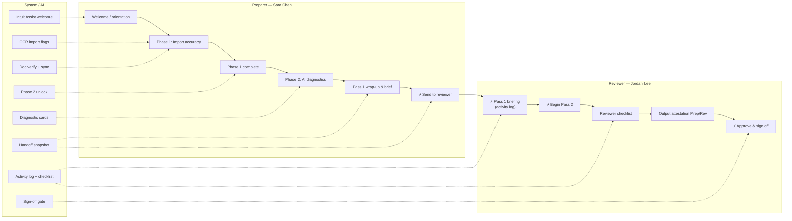

# SmartReview — Preparer & Reviewer Journey Map

**Prototype:** SmartReview-ProtoC2 (multi-pass handoff)  
**Return:** Jessica Drake · 1040  
**Roles:** Sara Chen (preparer) · Jordan Lee (reviewer)

---

## Overview

SmartReview splits tax return review into **data accuracy first, insights second**. Sara (preparer) completes **Pass 1** in two sequential phases—import accuracy, then AI diagnostics—before handing the return to Jordan (reviewer). Jordan opens a **Pass 1 briefing** (activity log), then begins **Pass 2** with a phased reviewer checklist, output attestation, and sign-off. The **Smart review brief** is the shared handoff surface across both roles.

---

## Swimlane journey map



---

## Moments table

| Phase | Actor | What they do | UI surface | Outcome |
|-------|-------|--------------|------------|---------|
| Welcome | Preparer | Reads two-step overview; starts import review | Welcome pane (Intuit Assist) | `phase = import`; review begins |
| Import accuracy | Preparer | Verifies source PDFs against OCR fields; edits or marks correct | Source docs panel + detail fields (W-2, 1099s); Phase 1 banner; 1040 minimized | Import flags cleared; docs marked verified |
| Import complete | Preparer | Confirms all flags + docs done | Phase 1 completion message | Phase 2 unlocks (`Continue to AI Diagnostics`) |
| AI diagnostics | Preparer | Reviews compliance, YoY, opportunities; marks reviewed | Agent report pane (AI Review); 1040 expanded | First-pass diagnostics cleared |
| Output attestation (Pass 1) | Preparer | Checks summary lines on 1040 / schedules | Output forms + **Prep** attest column | Preparer checks stamped (who/when) |
| Pass 1 brief | Preparer | Reviews own activity before handoff | Smart review brief → preparer summary tab | Activity log ready for reviewer |
| **Handoff 1** | Preparer | Sends return to reviewer | Brief → `Pass to reviewer` → `Send to reviewer` | `awaiting-reviewer` state; snapshot frozen |
| Pass 1 briefing | Reviewer | Reads Sara's Pass 1 work | Smart review brief → **activity log** (reviewer-briefing) | Context before independent review |
| **Handoff 2** | Reviewer | Starts independent Pass 2 | `Begin Pass 2 review` | `reviewPass = 2`; strategic checklist opens |
| Reviewer checklist | Reviewer | Works phased checklist (4 phases); attests manual items | Brief → **Reviewer checklist** tab + executive brief | Open items → attested items |
| Output attestation (Pass 2) | Reviewer | Confirms preparer lines; re-confirms after edits | Output forms + **Rev** attest column | Dual Prep/Rev trail on summary rows |
| Notes & flags | Reviewer | Resolves preparer notes / flagged items | Notes pane; open-items filter chips | Outstanding count → 0 |
| **Handoff 3** | Reviewer | Signs off return | `Approve & sign off return` | Return marked reviewed; ready to file |

---

## Handoffs

1. **Preparer → Reviewer (Send to reviewer)**  
   - **Trigger:** Sara completes Pass 1 (import + diagnostics) and chooses `Pass to reviewer` → `Send to reviewer`.  
   - **Transfers:** Handoff snapshot (open vs. done groupings), full activity log (documents verified, flags cleared, edits, summary checks, diagnostics reviewed), preparer attestations on output forms, notes, live return amounts, phase completion state.

2. **Pass 1 briefing → Pass 2 (Begin Pass 2 review)**  
   - **Trigger:** Jordan reads activity log and clicks `Begin Pass 2 review` (or demo `Open as reviewer`).  
   - **Transfers:** Same persisted session state; UI switches to `reviewPass = 2`, `reviewRole = reviewer`, `phase = diagnostics`; brief opens on **Reviewer checklist** tab with Pass 1 executive brief and four strategic phases.

3. **Pass 2 complete → Sign-off (Approve & sign off)**  
   - **Trigger:** All required checklist items attested, outstanding open items = 0, reviewer Rev confirmations current.  
   - **Transfers:** Sign-off readiness gate releases; reviewer attestation state and manual checklist completions are the record of Pass 2 approval.

---

## Review aspects checklist

| Aspect | Pass / phase | Primary actor | How it's satisfied |
|--------|--------------|---------------|-------------------|
| **Import accuracy** | Pass 1 · Phase 1 (`import`) | Preparer | Clear all OCR/import flags; verify each packet document |
| **Doc verification** | Pass 1 · Phase 1 | Preparer | Mark docs verified against source PDFs (W-2, 1099-INT/DIV/R, etc.) |
| **Diagnostics** | Pass 1 · Phase 2 (`diagnostics`) | Preparer | Mark each AI diagnostic card reviewed in Agent report pane |
| **Output attestation** | Pass 1 & 2 | Preparer then Reviewer | Prep ✓ on summary/1040 rows; Rev ✓ confirms for sign-off |
| **Reviewer checklist** | Pass 2 | Reviewer | Four brief phases + manual attestation items in Smart review brief |
| **Sign-off** | Pass 2 complete | Reviewer | `Approve & sign off return` when checklist + open items clear |

### Activity log categories (Pass 1 audit trail)

| Category | What it records |
|----------|-----------------|
| Documents verified | Each source doc marked verified against PDF |
| Import flags cleared | OCR/import flags resolved (edit or mark correct) |
| Amount edits (no flag) | Field edits not tied to a cleared import flag |
| Return summary reviewed | Preparer attestation on 1040 summary lines |
| First-pass diagnostics cleared | AI diagnostic cards marked reviewed in Phase 2 |

### Strategic checklist phases (Pass 2)

Milestone checklist aligned to CPA review doc — see [milestone-checklist-design.md](./milestone-checklist-design.md):

1. **Phase 1:** Client information & file setup  
2. **Phase 2:** Income verification (tie-outs)  
3. **Phase 3:** Deductions & adjustments  
4. **Phase 4:** Credits & tax calculations  
5. **Phase 5:** Variance analysis & final check  

Each milestone tracks **who completed it** (single- or dual-person) and uses **auto**, **linked**, or **declaration** completion types.

---

## Key UI surfaces (quick reference)

| Surface | When used |
|---------|-----------|
| **Source documents panel** | Phase 1 — side-by-side doc + fields |
| **AI Review panel** | Phase 2 — diagnostic cards |
| **Summary / output forms** | 1040, schedules; Prep/Rev attest columns |
| **Summary button → Smart review brief** | Pass 1 wrap-up, Pass 1 briefing, Pass 2 checklist |
| **Phase banners** | Progress for import flags and diagnostics |
| **Notes pane** | Preparer notes; reviewer resolution in Pass 2 |

---

## Export to PDF

**Recommended:** Open `docs/review-journey-map.html` in a browser → **Print** → **Save as PDF**.

Alternatively, from the project root:

```bash
npx --yes md-to-pdf docs/review-journey-map.md
```

If a `review-journey-map.pdf` exists alongside this file, it was generated automatically during doc build.

---

*Generated from SmartReview-ProtoC2 implementation — `DataReviewPage.tsx`, `HandoffSummary.tsx`, `smartReviewBrief.ts`, `useSyncedReviewState.ts`.*
